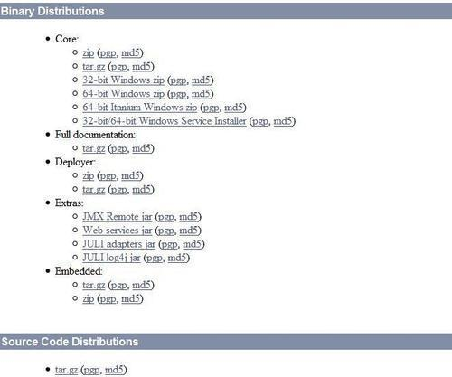
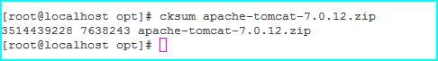
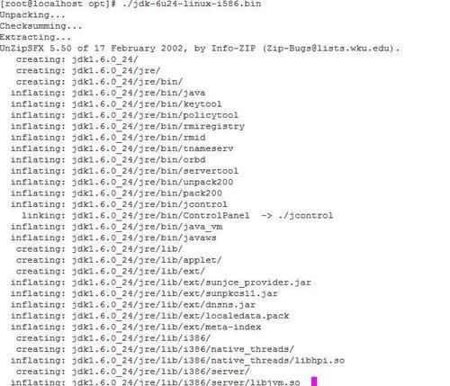
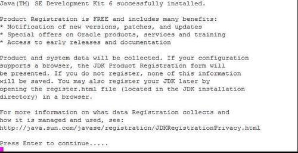
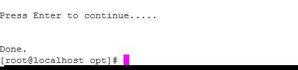
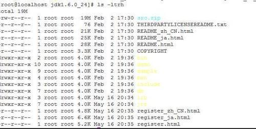
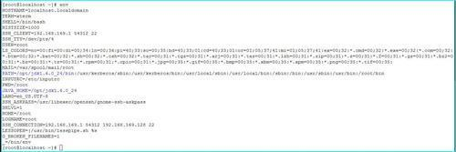
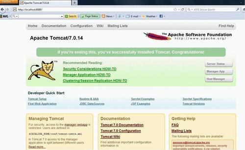
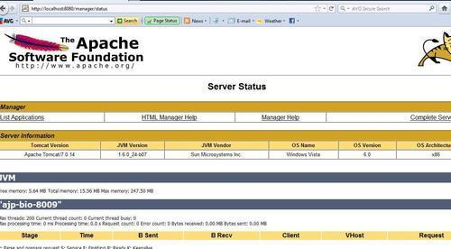

Lab 1. Installation of Tomcat 8
--------------------------------------------


Apache Tomcat is an open source Java-based web and servlet container,
which is used to host Java-based applications. It was first developed
for Jakarta Tomcat. Due to an increase in demand, it was later hosted as
a separate project called Apache Tomcat, which is supported by The
Apache Software Foundation. It was initially developed by James Duncan
Davidson, a software architect at Sun Microsystems. He later helped make
this project open source and played a key role in donating this project
from Sun Microsystems to The Apache Software Foundation. Tomcat
implements the[ **Java Servlet** and the[ **JavaServer Pages** (JSP) specifications from Sun
Microsystems, and provides a \"pure Java\" HTTP web server environment
for Java code to run.

In this lab, we will discuss the following topics:

- Introduction to Tomcat 8
- Features of Tomcat 8
- Installation on Linux operating systems
- Common areas of troubleshooting during installation


History of Tomcat
-----------------------------------

Tomcat was first introduced to the open source group in 1999 and its
first version was released with 3.0.x version. Since then, it has been
greatly supported by the open source community and widely accepted in
the IT industry. In the current scenario, Tomcat is running in
production environments, as well as being used for mission-critical
projects in various industries. The following mentioned details give us
a quick history of the versions.


#### Web application memory leak detection and prevention


Tomcat had a chronological problem of memory leaks in 4.x/5.x versions.
While reloading the applications in the entire life cycle of Tomcat,
OutOfMemoryError exceptions were generated. Tomcat has put an
exceptional effort in tracking down the bugs and issues related to
memory, in order to avoid memory leaks.


#### Servlet 3.0


Tomcat 8 offers great support for Servlet 3.0. Servlet 3.0 helps
developers to code very easily and also provides significant support for
asynchronous programming techniques. The types of support provided
are:

- **Asynchronous Support:**
- **Dynamic Configuration:**
- **Annotation-based Configuration:**

#### Improved logging


Tomcat 8 includes two new features for logging, in order to provide a
good understanding to the users for log analysis:

- **Asynchronous file handler:** The asynchronous handler
    allows Tomcat to write logs to the disk by a dedicated thread, so
    that logging operations do not cause any delay in processing
    threads.
- **Single line log formatter:** The single line formatter
    writes logs in a single line, which is a better feature for
    administrators.


Installation of Tomcat 8
------------------------------------------


In the previous section, we have discussed the new enhancements in
Apache Tomcat 8. Now, it\'s time to move on to the Tomcat
installation.


### How to download the Tomcat software


Perform the following steps to download the software:


- Before we start the installation of Apache Tomcat 8 software, the
    first thing that comes to mind is where can you download the
    software from and also how much does the license cost? By default,
    Apache comes with Apache License, Version 2.0 ,which is compatible
    to GPL (General Public License). In simple terms, it is free of
    cost! For more information on licenses, you can visit
    <http://www.apache.org/licenses/>. Now, the second problem is how to
    download the software.
- It is always recommended to download the software from its official
    site, <http://tomcat.apache.org/download-70.cgi>. By default, on
    <http://tomcat.apache.org/>, we get the latest stable version of
    Tomcat package and we have to download the package based on the
    operating system, where we want to install it.





Once the download is complete, then you have to do the integrity check
for the downloaded software using the MD5 checksum.


### Note


MD5 Message-Digest Algorithm is a widely used cryptographic hash
function that produces a 128-bit (16 byte) hash value.


Following is the process to perform the integrity check using the MD5
checksum:


1.  Download the MD5 checksum from the website apache.org. The MD5 check
    sum is integrated with every package we download. The previous
    screenshot shows the packages which are available in MD5, and by
    clicking on md5 on the website, we can compare the checksum
    generated in our system with the value given on the site.

2.  Run the following command to generate the checksum for the
    downloaded software. See the following screenshot:

    ```
    [root@localhost opt]# cksum apache-tomcat-8.5.61.zip
    ```


    




Tomcat comes with different packages for installation such as binary,
source, and RPM. Based on the requirement, the package should be taken
from the official site. Let\'s have a brief discussion on which package
should be implemented in real time and why.


#### Binary package


It comes with a pre-set library and customized configuration which are
implemented and tested as per industry standards. A few advantages of
using the binary package are:

- It is a standard package that suits most of the real-time
    environments
- In a non-DOS environment (such as Linux, UNIX, and so on), we can
    configure multiple Tomcat instances on a single OS
- It is path independent; we can configure Tomcat in any part of the
    OS based on our resources available (hardware)


#### RPM/exe


RPM is defined as a system installer, which is developed and compiled on
each OS independently. It has a pre-defined library, which will work
only on the respective OS. A few advantages of using RPM are:


- It does not require installation of any dependent libraries for the
    package
- RPM is built with the shared libraries for the respective OS
- It does not need to configure separate startup services


The only disadvantage is, we cannot configure multiple instances in a
single operating system and it has predefined paths.


#### Source


You can customize the installation based on your requirements using the
source package. Suppose you want to customize during installation of the
software, it can be done in this package.

- Customization of Tomcat can be done very effectively (only required
    services are installed)
- In a non-DOS environment (such as Linux, UNIX, and so on), we can
    configure multiple Tomcat instances on a single OS
- It is path independent; we can configure Tomcat in any part of the
    OS based on our resources available (hardware)
- In a production environment, it\'s always recommended to use the
    source or binary instead of the RPM


### Prerequisites for the Tomcat 8 installation


Before we begin with the Apache Tomcat 8 installation, we have to
configure the prerequisites and they are very important for the Tomcat 8
installation to start. Following are the prerequisites mentioned for
Apache Tomcat 8:

- Java SE 1.6 or later
- Configuration of the OS environment variables


#### Installation of Java


Java has been developed by many vendors. Based on the application
requirement and type of architecture, different JVMs are used by various
applications. Common JDK vendors are IBM, HP, Sun, OpenJDK, and so on.
Sun holds a major stake in IT industries. JDK is widely used and
accepted across various IT industries.

JDK packages are available for each OS and can be compiled on any system
using a common set of libraries. These packages are easily available on
the Internet or already integrated with different OS vendors.

JDK/JRE comes in 32 bit and 64 bit editions, so we can use it based on
the application requirement. Some of the performance characteristics of
the 64 bit versus 32 bit[ **Virtual Machine**
(**VM**) are:

- The benefits of using 64 bit are being able to address larger
    amounts of memory which comes with a small performance loss in 64
    bit VMs, versus running the same application on a 32 bit VM
- You can allocate more than 4 GB to JVM for memory intensive
    applications


### Note

In a 64 bit Java edition, you have to allocate more memory for JVM as
compared to a 32 bit edition. In practice, a 64 bit Java requires 30
percent more memory than the 32 bit Java version.


##### Installation of Java in Linux


In this topic, we will discuss the steps performed during installation
of Java on Linux:


1.  Download the JDK from the Oracle site on the Linux system.

    
    ### Note

    For more information about the version changes and releases, visit
    <http://www.oracle.com/technetwork/java/javase/downloads/index.html>.

    We are doing the installation on the` /opt` partition of
    the hard drive and the Java version we are using is Java(TM) SE
    Runtime Environment (build 1.6.0\_24-b07).


- Once the download is complete, it will create the binary file in
        `/opt` (`jdk-6u24-linux-i586.bin`).


2.  Change the permission of the package using the following command:

    ```
    chmod 0755 jdk-6u24-linux-i586.bin
    ```


    
    ### Note

    The` chmod 0755 file` is equivalent
    to` u=rwx (4+2+1),go=rx (4+1 & 4+1)`. The` 0`
    specifies no special modes.


3.  Run the following command to install the JDK:

    ```
    [root@localhost opt]# ./jdk-6u24-linux-i586.bin
    ```


- You will see an output similar to the following screenshot:


    




4.  During the installation, the binary will prompt for the acceptance
    of the agreement, then press Enter. See the following screenshot:

    
-

-


5.  After pressing Enter it will exit from the command prompt, as shown
    in the following screenshot:

    




6.  After the installation is complete, the binary will create the
    folder named jdk1.6.0\_24 in /opt. If the folder is present in /opt,
    that means the installation is successfully done. See the following
    screenshot:

    
-

-


Let\'s quickly go through the JDK directory structure, shown in the
previous screenshot:

- `bin:` It contains the entire executable for the JDK for
    java, javac, jmap, and so on.
- `jre:` It contains all the files necessary for Java to
    perform the function.
- `lib:` As the name suggests, it\'s a library directory for
    the JDK.
- `man:` This directory contains all the manual pages for
    Java (document directory).
- `demo:`-This folder contains working examples of different
    utilities. These utilities can be directly used.
- `sample:` This directory contains the code files for
    utilities provided in the demo directory.
- `include:` It contains the header files for different
    functions used in Java.h
- `db:` It contains the entire component of the Derby
    Database. Derby is a pure Java relational database engine.


##### Setting the JAVA\_HOME and the PATH environment variable in Linux


The environment variable and path are set differently in Linux as
compared to Windows. Perform the following steps to set the environment
variable in Linux:


1.  Open the .bash\_profile using the vi editor for the root user.

    
    ### Note

    You can put the environment variable in` bashrc` also. It
    will also execute at the time of the user login.


2.  Add the following environment variable in the file. The following is
    the code snippet of .bash\_profile. The highlighted code shows the
    declaration of JAVA\_HOME and PATH. export will add the JAVA\_HOME
    and PATH to the system parameter for every user login.

    ```
    # .bash_profile
    # Get the aliases and functions
    if [ -f ~/.bashrc ];then . ~/.bashrc
    fi
    # User specific environment and start-up programs
    JAVA_HOME=/usr/lib/jvm/java-8-openjdk-amd64
    PATH=$JAVA_HOME/bin:$PATH:$HOME/bin
    export PATH JAVA_HOME
    unset USERNAME
    ```


3.  Save the .bash\_profile using the :wq command.

4.  Once you have saved the .bash\_profile, then you have to logout and
    re-log in to the environment to activate the changes using the
    following command:

    ```
    su - username
    su - root (as our user is root)
    ```


    
    ### Note

    If we run the previous command for any user, then the profile of
    that user will be reloaded.


Also, you can run the` env` command to verify the environment
variables are configured properly, as shown in the following screenshot:





### Note

It is always best practice to first take the backup of the existing
profile. In case there are issues while doing the changes, then we can
revert back the changes using the command` cp`


```
[root@localhost ~]# cp .bash_profile .bash_profile_backup.
```


Now we have set the environment variable for Windows and Linux
environments, but how can we verify whether the environment is set
properly or not?


In Linux, we can use the following command to verify the environment
variables:


```
echo $VARIABLE_NAME
```


For` JAVA_HOME:`


```
[root@localhost ~]# echo $JAVA_HOME
/usr/lib/jvm/java-8-openjdk-amd64
```


For` PATH:`


```
[root@localhost ~]# echo $PATH
/usr/lib/jvm/java-8-openjdk-amd64/bin:/usr/kerberos/sbin:/usr/kerberos/bin:/usr/local/ sbin:/usr/local/bin:/sbin:/bin:/usr/sbin:/usr/bin:/root/bin
```


After verifying the environment variable on both the OSes, we are sure
that` JAVA_HOME` and` PATH` are properly set in the
environment. We have completed the prerequisites of installation of
Apache Tomcat 8. Now, we can proceed with the installation of Apache
Tomcat 8.


### Installation of Apache Tomcat 8


Installation of Tomcat 8 is quite simple in a Linux environment. It can be done in just three steps:


1.  Download the latest stable version from Tomcat\'s official site
    http://tomcat.apache.org/download-70.cgi. Once the download is
    complete, save it in the /opt location. Unzip the Tomcat 8 source,
    that is, apache-tomcat-8.5.61.zip using the following command:

    ```
    [root@localhost opt]# unzip apache-tomcat-8.5.61.zip
    ```


2.  After you unzip the apache-tomcat-8.5.61.zip, it will create the
    directory named apache-tomcat-8.5.61 in the opt directory. Go to the
    bin directories of apache-tomcat-8.5.61 using the following command:

    ```
    [root@localhost opt]# cd apache-tomcat-8.5.61/bin/
    ```


3.  Run the following command. If you fail to run the following command,
    then Tomcat services will not come up. By default, the package comes
    with read/write permissions, but no execution permissions are given
    to the package. We have to manually change the permissions:

    ```
    [root@localhost bin]# chmod 0755 *.sh
    [root@localhost bin]# pwd
    /opt/apache-tomcat-8.5.61/bin
    ```

    
    ### Note

    The` chmod 0755 file` is equivalent
    to` u=rwx (4+2+1),go=rx (4+1 & 4+1)`. The` 0`
    specifies no special modes.


After this step, the installation of Tomcat is complete in Linux.


### Startup and shutdown of Tomcat services


Let us start the services on Linux to verify the installation.

Before that, let\'s quickly verify the configuration. Tomcat 8 comes
with different scripts, through which we will verify the complete
installation. There is a very good script placed in the
Tomcat` bin` directory named as` version.sh`,
through which we can verify the complete Tomcat version and system
information. Let\'s run the script using the following command:


```
[root@localhost bin]# ./version.sh
Using CATALINA_BASE: /opt/apache-tomcat-8.5.61
Using CATALINA_HOME: /opt/apache-tomcat-8.5.61
Using CATALINA_TMPDIR: /opt/apache-tomcat-8.5.61/temp
Using JRE_HOME: /usr/lib/jvm/java-8-openjdk-amd64
Using CLASSPATH: /opt/apache-tomcat-8.5.61/bin/bootstrap.jar:/opt/apache-tomcat-8.5.61/bin/tomcat-juli.jar
Server version: Apache Tomcat/7.0.12
Server built: Apr 1 2011 06:13:02
Server number: 7.0.12.0
OS Name: Linux
OS Version: 2.6.18-8.el5
Architecture: i386
JVM Version: 1.6.0_24-b07
JVM Vendor: Sun Microsystems Inc.
```


There is one more script in the Tomcat` bin` directory that is
very useful.` configtest.sh` is used to check any
configuration changes in scripts. This script performs a quick
configuration check on the system and finds the errors. Let\'s run the
script using the following command:


```
[root@localhost bin]# ./configtest.sh
Using CATALINA_BASE: /opt/apache-tomcat-8.5.61
Using CATALINA_HOME: /opt/apache-tomcat-8.5.61
Using CATALINA_TMPDIR: /opt/apache-tomcat-8.5.61/temp
Using JRE_HOME: /usr/lib/jvm/java-8-openjdk-amd64
Using CLASSPATH: /opt/apache-tomcat-8.5.61/bin/bootstrap.jar:/opt/apache-tomcat-8.5.61/bin/tomcat-juli.jar
May 22, 2011 4:06:16 PM org.apache.coyote.AbstractProtocolHandler init
INFO: Initializing ProtocolHandler ["http-bio-8080"]
May 22, 2011 4:06:16 PM org.apache.coyote.AbstractProtocolHandler init
INFO: Initializing ProtocolHandler ["ajp-bio-8009"]
May 22, 2011 4:06:16 PM org.apache.catalina.startup.Catalina load
INFO: Initialization processed in 1401 ms
```


### Note

`configtest.sh` is available in a Linux environment only.


After doing the configuration check, start the Tomcat services. The
Tomcat services can be started using the` startup.sh` in
the` bin` directory.


#### Startup script


To start the Tomcat services, you have to perform the following
mentioned steps:


1.  The first step is to change the directory from the current location
    to the Tomcat directory.

    ```
    [root@localhost bin]# cd /opt/apache-tomcat-8.5.61/bin/
    ```


2.  In the bin directory, we will find the entire executable for Tomcat.
    To start the services, we have to use the following command. Once
    you execute the startup command, it will display the parameters
    which are essential for booting Tomcat. Some of them are
    CATALINA\_BASE, CATALINA\_HOME, JRE\_HOME, and so on.

    ```
    [root@localhost bin]# ./startup.sh
    Using CATALINA_BASE: /opt/apache-tomcat-8.5.61
    Using CATALINA_HOME: /opt/apache-tomcat-8.5.61
    Using CATALINA_TMPDIR: /opt/apache-tomcat-8.5.61/temp
    Using JRE_HOME: /usr/lib/jvm/java-8-openjdk-amd64
    Using CLASSPATH: /opt/apache-tomcat- 7.0.12/bin/bootstrap.jar:/opt/apache-tomcat-8.5.61/bin/ tomcat-juli.jar
    ```


#### Shutdown script


A Tomcat shutdown script is also available in the` bin`
directory named as` ./shutdown.sh`. Let\'s execute the script
to know the output. The details are as follows:


```
[root@localhost bin]# cd /opt/apache-tomcat-8.5.61/bin/
[root@localhost bin]# ./shutdown.sh
Using CATALINA_BASE: /opt/apache-tomcat-8.5.61
Using CATALINA_HOME: /opt/apache-tomcat-8.5.61
Using CATALINA_TMPDIR: /opt/apache-tomcat-8.5.61/temp
Using JRE_HOME: /usr/lib/jvm/java-8-openjdk-amd64
Using CLASSPATH: /opt/apache-tomcat- 7.0.12/bin/bootstrap.jar:/opt/apache-tomcat-8.5.61/bin/tomcat-juli.jar
```


### Verification of Tomcat status


Once we have executed the startup scripts, the next step is the
verification of the Tomcat services, to check whether services are
coming up fine or not. By default, Tomcat runs on HTTP port 8080 and can
be accessed on the web browser using the
URL,` http://localhost:8080`. We then find the Tomcat welcome
page, which shows that Tomcat is installed correctly and running fine in
the environment, as shown in the following screenshot:





Once the welcome page for Tomcat 8 is displayed, we can verify the
server status by clicking on[ **Server Status.** 


It will prompt for the user ID/password. Remember, we have created a
user admin that the user ID will be used here for access, as shown in
the following screenshot:





Common problems and troubleshooting in installation
---------------------------------------------------------------------


There are multiple issues which may arise during the installation of
Tomcat 8. Let\'s discuss these issues:


### Error: Permission denied for the Java binary


**Scenario 1:** The Java installation is not working, while
executing the Java binary.


```
[root@localhost opt]# ./jdk-6u24-linux-i586.bin
-bash: ./jdk-6u24-linux-i586.bin: Permission denied
```


**Issue:** The Java binary doesn\'t have execute permissions
with a specific user.

**Fix:** Change the permission to 0755
for` ./jdk-6u24-linux-i586.bin` using the following command:


```
chmod 0755 jdk-6u24-linux-i586.bin
```


### Note


The` chmod 0755 file` is equivalent
to` u=rwx (4+2+1),go=rx (4+1 & 4+1)`. The` 0`
specifies no special modes.


### Error: Tomcat is not able to find JAVA\_HOME


**Scenario 2:** While starting the Tomcat startup script, the
following error occurs:


```
[root@localhost bin]# ./startup.sh
Neither the JAVA_HOME nor the JRE_HOME environment variable is defined
At least one of these environment variables is needed to run this program
```


**Fix:** Check the` .bash_profile` and find out
whether the following mentioned entry is present in the file:


```
JAVA_HOME=/usr/lib/jvm/java-8-openjdk-amd64
PATH=$JAVA_HOME/bin:$PATH:$HOME/bin
export PATH JAVA_HOME
```


### Error: Error in the logs showing port already in use


**Scenario 3:** Tomcat services is not displayed after
running` startup.sh`.

**Issue:** This service is already running on the server.

**Fix:** Check for any Java process running in the system
using the following command in Linux:


```
Ps -ef |grep tomcat
```


This command will show all Tomcat processes. If any process is running
on an OS, kill it and run the startup scripts again.


Summary
---------

In this lab, we have covered the Apache Tomcat history and new
features introduced in Tomcat 8. We have done a step-by-step
installation of Tomcat on Linux operating system.

In the next lab, we will discuss the various methods used for
deployment in Tomcat 8 and solution of issues that may occur during the
deployment process.
