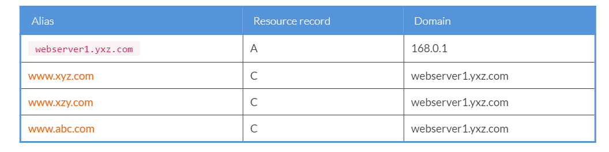
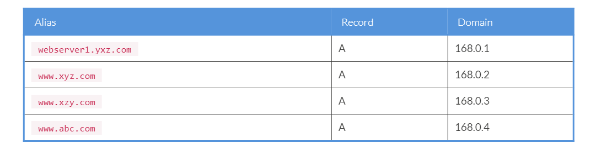

Lab 11. Advanced Configuration for Apache Tomcat 8
---------------------------------------------------------------


In the previous labs, we have discussed various topics for Tomcat 8
such as clustering, load balancing and so on. But, in practice, there
are some different configurations needed to perform on the system, apart
from the Tomcat internal configuration, in order to manage the systems.
In this lab, we will discuss the advanced topics for Tomcat 8, used
in real-world industries, to create the web infrastructure and support
multiple web applications.

In this lab, we will discuss the following topics:

- Virtual hosting
- Running multiple applications on a single Tomcat server
- Multiple Tomcat environments such as Development, QA, Stage, and
    Production
- Tuning cache
- Optimization of Tomcat


Virtual hosting
---------------------------------


It\'s a method through which you can host multiple domain names on the
same web server or on a single IP. The concept is called shared hosting,
where one server is used to host multiple websites. For example, if you
want to host` abc.com` and` xyz.com`, and later you
want to add one more website on the same web server, that can be
achieved by virtual hosting. Basically, there are two types of virtual
hosting:

- Name-based virtual hosting
- IP-based virtual hosting


### Name-based virtual hosting


It\'s a method through which you can host multiple domains on a single
IP. It uses the concept of shared services. In practice, web hosting
companies follow this approach to host multiple sites for a low cost.
For example, we have multiple sites such as
[www.abc.com](http://www.abc.com/),[www.xyz.com](http://www.xyz.com/),
and [www.xzy.com](http://www.xzy.com/), and we want to configure
it on the single web server using a single IP, then name-based virtual
hosting is used. Following are the advantages of name-based virtual
hosting:

- Putting more than one website on a server using a single IP address
- Easy to configure
- Shared SSL certificates


In case you want to implement a named-based virtual host on the web
server, then you have to complete the following prerequisites before
doing the configuration.

For example, if you want to host the previous mentioned sites on the web
server, then we have to perform the following mentioned methods to
configure the **Domain Name Server** (**DNS**).
Let us assume the web server name is` webserver1.yxz.com` and
is hosted on the IP 192.168.0.1. You have to add the following records
in your DNS server:



Once these records are created, you can configure the virtual server in
the web server configuration.


### Note

A = Address record, used to map the hostname with an IP address.

C = CNAME is used to create multiple aliases for a single hostname.


### IP-based virtual hosting


It\'s a method through which you can host multiple websites on the same
server using a different IP. This approach follows the concept of a
Dedicated Environment. Here, you can also configure multiple websites on
a single server, but the only difference is the domain is configured on
a different network interface.

Following are the advantages of IP-based virtual hosting:

- Hosting more than one website on a single server using different network interface addresses (different IP address)
- Dedicated network interface
- Dedicated SSL certificates


In case you want to implement IP-based virtual hosting on the web
server, then you have to complete the following prerequisites before
doing the configuration.

For example, if you want to host the previously mentioned sites on the
web server, then the DNS will be configured in the following manner. Let
us assume the web server name` webserver1.yxz.com` is hosted
on the IP 192.168.0.1. All the other domains are configured on a
different IP (192.168.0.2, 192.168.0.3, and 192.168.0.4), as shown in
the following table:



Once these records are created, you can configure the virtual server in
the web server configuration.


Virtual hosting in Tomcat 8
---------------------------------------------


Tomcat 8 supports name-based virtual hosting. This approach is very
useful in hosting multiple web applications on the single instance of
Tomcat 8. It also gives more privileges to the administrator to separate
the applications from each other and their access control restrictions.
You cannot understand the real concept of virtual hosting unless you
implement it. So why wait, let\'s do the real-life implementation for
virtual hosting in Tomcat 8.


1.  Run `dig <your-lab-environment-url>` in the terminal to find out IP of the server.


2.  For implementing virtual hosting, you have to edit server.xml, which
    is present in TOMCAT\_HOME/conf.

    The following entries need to be added for the virtual host, as shown in the following screenshot:

    ```
    
     <Host name="www.xyz.com"  appBase="webapps"
           unpackWARs="true" autoDeploy="true">
 
	     <Valve className="org.apache.catalina.valves.AccessLogValve" directory="logs"
               prefix="virtual1_access_log" suffix=".txt"
               pattern="%h %l %u %t &quot;%r&quot; %s %b" />
 
	</Host>

     <Host name="www.xzy.com"  appBase="webapps"
           unpackWARs="true" autoDeploy="true">
 
	     <Valve className="org.apache.catalina.valves.AccessLogValve" directory="logs"
               prefix="virtual2_access_log" suffix=".txt"
               pattern="%h %l %u %t &quot;%r&quot; %s %b" />
 
	</Host>

     <Host name="www.abc.com"  appBase="webapps"
           unpackWARs="true" autoDeploy="true">
 
	     <Valve className="org.apache.catalina.valves.AccessLogValve" directory="logs"
               prefix="virtual3_access_log" suffix=".txt"
               pattern="%h %l %u %t &quot;%r&quot; %s %b" />
 
	</Host>
    ```


3.  Once configuration is done, add the new DNS in the hosts file found
    in /etc/hosts in Linux. The following screenshot shows the addition of a different
    hostname and IP address in the hosts file:


    ```
    <server-ip>		    <lab-environment-url>.eastus.cloudapp.azure.com
	<server-ip>		    www.xyz.com	
	<server-ip>		    www.xzy.com	
	<server-ip>		    www.abc.com	
    ```   

4.  Save the configuration, followed by the recycle, and check the logs
    if any errors persist.

5.  Check the URLs http://www.xyz.com:8080 , http://www.xzy.com:8080 , http://www.abc.com:8080 in the browser.


Hostname aliases
----------------------------------


There is one more important feature that comes with Tomcat 8 called[
**Host name aliases**. It\'s a very good feature that gives
freedom to the administrator for multiple sites on the same
network

For example, if you have a website which needs to be accessed through a
subdomain by different users, then host aliases are created. It\'s also
called **Sub domain aliases** for the main domain. It is not
possible to implement aliases in the previous versions of Tomcat. In
case we want to implement aliases for any website, we have to use
Apache, IIS, or a separate web server before Tomcat as a front-end
server.

The following mentioned code describes how to set the alias for a
particular site:


```
<Host name="www.xyz.com"  appBase="/opt/apache-tomcat-8.5.61/webapps/sample"
        unpackWARs="true" autoDeploy="true">

        <Valve className="org.apache.catalina.valves.AccessLogValve" directory="logs"
            prefix="virtual1_access_log" suffix=".txt"
            pattern="%h %l %u %t &quot;%r&quot; %s %b" />

        <Alias>tomcatalias.com</Alias>
</Host>
```


Followed by recycle, once the system is up, you can browse the same
application with different names.


Multiple Tomcat environments---Development/QA/Stage/Production
--------------------------------------------------------------------------------


Information technology organizations follow a set of environments to
manage their applications. These environments are based on their
functionality and usage. Support available for any environment depends
on the environment\'s functionality. Based on the functionality, the
production environment has a high priority and development the least
priority, as shown in the following figure:


The following table compares the different environments and their
functionalities with respect to different tasks performed during
creation and management of the web infrastructure:


Tuning cache
------------------------------


When we are running multiple applications on Tomcat 8, it is always
recommended to utilize the resource correctly. In order to do so, we
need to optimize the tuning parameter. Every time the server receives a
request, it consumes the amount of CPU and memory in the system. In
order to resolve this problem, we generate cache on the server from the
first request. One of the best examples used for caching in major web
hosting organizations is to generate cache for the static
content.

The following code shows the configuration for
adding` Expires` and` Cache-Control: max-age=`
headers to images, CSS, and JavaScript. This code is added
in` web.xml`, which is present
in` TOMCAT_HOME/CONF.` 


```
<filter>
<filter-name>ExpiresFilter</filter-name>
<filter-class>org.apache.catalina.filters.ExpiresFilter</filter-class>
<init-param>
<param-name>ExpiresByType image</param-name>
<param-value>access plus 15 minutes</param-value>
</init-param>
<init-param>
<param-name>ExpiresByType text/css</param-name>
<param-value>access plus 15 minutes</param-value>
</init-param>
<init-param>
<param-name>ExpiresByType text/javascript</param-name>
<param-value>access plus 15 minutes</param-value>
</init-param>
</filter>
<filter-mapping>
<filter-name>ExpiresFilter</filter-name>
<url-pattern>/*</url-pattern>
<dispatcher>REQUEST</dispatcher>
</filter-mapping>
```


Optimization of Tomcat 8
------------------------------------------

In lab 3, *Performance Tuning*], we have discussed various optimization
methods for Tomcat at the software level, but until now, we have not
done any system-level configurations. We will now discuss the various
optimization methods, which are required for system administrators to
make their work more successful. One of the most important things
required is to run the Tomcat services as a non-privileged
user.


### Running Tomcat 8 as a non privileged user


It is not recommended way to run Tomcat as the root, because of security
reasons and IT compliance policies. To resolve this issue, you have to
run Tomcat as a non-privileged user. To implement this, you have to
perform the following changes in the` user` permission. Let us
assume` tomcatuser1` will run the Tomcat server as a
non-privileged user.


```
# groupadd tomcatuser1
# useradd -g tomcatuser1 -d /opt/apache-tomcat1
# chown -R tomcatuser1:tomcatuser1 /opt/apache-tomcat1
```


Once you change the permission at the OS level, it\'s time to
set` tomcat` to run as a service. Now, copy the startup
scripts in` /etc/init.d` using the following commands:


```
cp /opt/apache-tomcat1/bin/startup.sh /etc/init.d/tomcat
cd /etc/rc5.d
sudo ln -s ../init.d/tomcat S71tomcat
```


You have now created` tomcat` as a service. But before running
the service, you have to change the permission to make it executable,
then run the service as` tomcat` using the following
command:


```
chown 0755 /etc/init.d/tomcat
```


Now we are ready to run` tomcat` as a service.


Summary

-------------------------


In this lab, we have discussed the advanced configuration of Tomcat
7 and optimization parameters, key points covered in the environment
such as virtual hosting, features of Development/QA/Stage/Production,
Tomcat as a service, and running Tomcat as a non privileged user.

With this lab, we have completed the journey of Tomcat 8. In this
course, I have tried to complete major issues, which the web
administrators and IT administrators face in day-to-day environments. I
hope by reading the topics, you have gained enough confidence in running
Tomcat 8 in real-time environments.