Lab 5. Securing Tomcat 8
-------------------------------------


The Internet has created a revolution in the 21st century; it provides
us the capability of collecting information in seconds, whereas it would
have taken months to collect the information previously. This has also
raised security concerns for information privacy and has created the
requirement of securing information over the Internet.

Everyday, new technologies are emerging to improve Internet usage for
applications. With these technologies in the market, it becomes a tricky
job for hackers and other communities to access secure
information.

In this lab, we will discuss the following topics:

- Tomcat security permissions
- Catalina properties
- SSL implementation on Tomcat 8


Tomcat Manager
--------------------------------


The security being a major concern for IT companies, a separate
department for IT security administration is created in every company.
Their major responsibility is to make sure that there are no
vulnerabilities in terms of the networks, web, and OS
infrastructure.

We should download Tomcat from the Tomcat website or any secure, known
host. There is a chance that malicious software is shipped with Tomcat
if we download it from an unknown source. Once the download is complete,
verify the integrity of Tomcat using MD5/PGP. In case of Linux, the MD5
can be verified with **Open Specification for Pretty Good Privacy** (**OpenPGP**). This is a must in the
process of production systems.


Tomcat security permissions
---------------------------------------------


Apache Tomcat comes with good security-enabled options, but every
environment has its own requirement for security, based on the usage of
the application. For example, banking sites require a high level of
security, on the other hand, user-based applications require little
security.

In Tomcat 8, the default permission is configured
in` TOMCAT_HOME/Conf` directory. The security is a collective
effort of four files which make the system. Let\'s discuss about each
file and their functionality.


### catalina.properties


This file contains information related to the access of the package,
package definition, common loader, shared loader, and a list of JAR
files, which are not necessary to be scanned at the startup of Tomcat.
It helps in improving the performance, as adding too many JAR files to
the skip list improves memory consumption. If you want to add any common
JAR, you have to define it
under` catalina.properties`.

In a production environment, some of the library JARs are shared across
many instances of Tomcat, and in that case we can use the shared loader
parameter. By default, the Tomcat 8 policy comes with the following
packages to enhance security. We can customize the policy based on the
application\'s requirement and usage type. Following are the key
syntaxes used in` catalina.properties:`


```
package.access=sun.,org.apache.catalina.,org.apache.coyote.,org.apache. tomcat.,org.apache.jasper.
package.definition=sun.,java.,org.apache.catalina.,org.apache.coyote., org.apache.tomcat.,org.apache.jasper
common.loader=${catalina.base}/lib,${catalina.base}/lib/*.jar, ${catalina.home}/lib,${catalina.home}/lib/*.jar
tomcat.util.scan.DefaultJarScanner.jarsToSkip= \bootstrap.jar,commons-daemon.jar,tomcat-juli.jar, \annotations-api.jar,el-api.jar,jsp-api.jar,servlet-api.jar, \catalina.jar,catalina-ant.jar,catalina-ha.jar, catalina-tribes.jar,\jasper.jar,jasper-el.jar,ecj-*.jar, \tomcat-api.jar,tomcat-util.jar,tomcat-coyote.jar, tomcat-dbcp.jar,\tomcat-i18n-en.jar,tomcat-i18n-es.jar, tomcat-i18n-fr.jar,tomcat-i18n-ja.jar,\ commons-beanutils*.jar,commons-collections*.jar,commons-dbcp*.jar, \commons-digester*.jar,commons-fileupload*.jar,commons-logging*.jar, \commons-pool*.jar,\ant.jar,jmx.jar,jmx- tools.jar,\xercesImpl.jar,xmlParserAPIs.jar,xml-apis.jar, \dnsns.jar,ldapsec.jar,localedata.jar,sunjce_provider.jar,
sunpkcs11.jar,tools.jar,\apple_provider.jar,AppleScriptEngine.jar, CoreAudio.jar,dns_sd.jar,\j3daudio.jar,j3dcore.jar,j3dutils.jar, jai_core.jar,jai_codec.jar,\mlibwrapper_jai.jar,MRJToolkit.jar, vecmath.jar
```


### catalina.policy


This file contains the Tomcat permission details and their deployed
application, which is used at runtime. If you want to access any system
parameter, such as the OS details, Tomcat internal code, or web
application code from different directories, you can define the
permission here. There are basically three kinds of permissions you can
implement on Tomcat 8. The following figure shows the different types of
polices for Catalina:


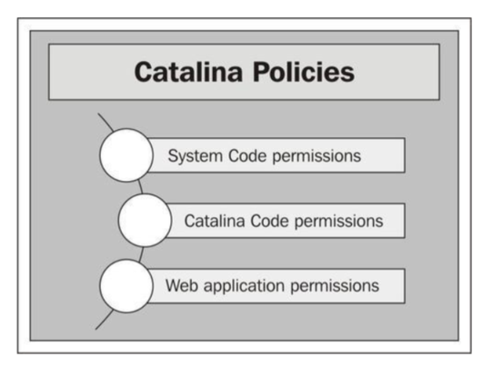

#### System Code permissions


This policy gives you access the Java library, which need to be verified
at runtime by the Tomcat instance. Following code shows that full access
permissions are granted for the Java library:


```
grant codeBase "file:${java.home}/lib/-" {permission java.security.AllPermission;
```


### Note


There are a few more policy options you can implement in Catalina, such
as System Code, Catalina Code, and Web application permissions.


The following points describe the different customized policies we can
add in Tomcat 8:

- Read/write access(R/W) to the document root of the web application.
- Read, write, and delete access to the user for the web application
    directory. The following screenshot shows the different options:

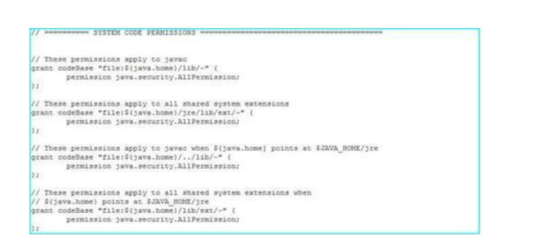


#### Catalina Code permissions (Tomcat core permission)


This section contains the Tomcat internal file permissions to access the
code. It helps in controlling the internal functionality of Tomcat. The
following policy shows that` Catalina/lib` has given all the
permissions:


```
grant codeBase "file:${catalina.home}/lib/-" {permission java.security.AllPermission;
```


This means that Tomcat has all the permissions to access
the` lib` folder.


### Note

The previous permission is used for the servlet API and their class
loader, which are shared among the different codes.


The following screenshot shows the Catalina Code permissions:

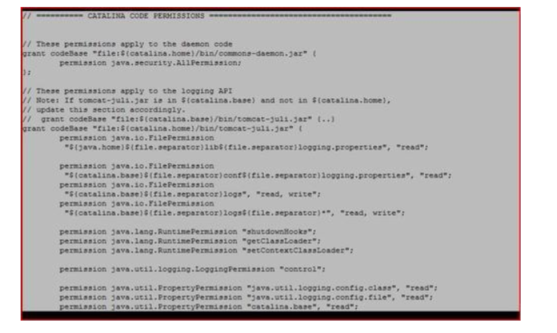


#### Web application permissions


This section contains the policy with reference to the application\'s
resource utilization, such as JVM, JNDI, and so on. If you enable the
following code, then the Tomcat classes can be accessed from the root
directory of the code:


```
// grant codeBase "file:${catalina.base}/webapps/examples/ WEB-INF/classes/-" {// };
```


The following screenshot displays the Web application permissions:

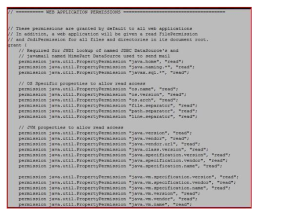

### Note

This policy will run from the root directory of the web application. If
you want to access it from outside, then you need to customize the
application.


### tomcat-users.xml


This file contains the roles and security password for Tomcat.


The following screenshot shows the different roles, users, and passwords
for Tomcat 8:

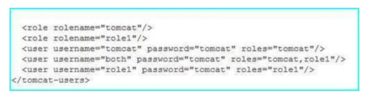

### server.xml


This is the main configuration file for Tomcat and it mainly contains
the` Connector port` configuration.

The following screenshot shows the connector configuration, where Tomcat
7 runs on 8080 and has 20000 as the timeout setting:

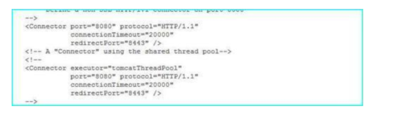


Enabling Tomcat Manager
-----------------------------------------


By default, the Tomcat Manager is disabled in Tomcat 8. It is a very
powerful tool, but if it goes to the wrong hands, then it can create a
problem for the system administrator or the application administrator.
So it\'s very important that you enable Tomcat Manager with proper
security.


### How to enable the Tomcat Manager


For enabling the Manager, we have to edit` tomcat-users.xml`,
which is present in` TOMCAT_HOME/conf`. You will see that
Tomcat users are commented out, as shown in the following
screenshot:

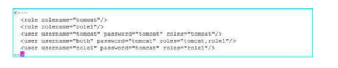

Uncomment the user and save the file, followed by reloading Apache Tomcat 8, as shown in the following screenshot:

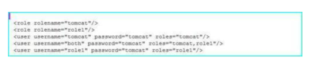

Securing Tomcat 8 for production
--------------------------------------------------


In this topic, we will discuss the best practices used for securing
Tomcat 8. Securing Tomcat does not mean only Tomcat, it includes both
Tomcat configurations and other infrastructure configurations. Let\'s
first start with the Tomcat configurations.


### Tomcat settings


There are different methods of securing Tomcat 8 and these come into
picture based on the application\'s requirement and the security policy
used by an IT organization.


### Note


Every organization has their own security policies and the IT
administrator follows them while implementing the security in Tomcat.


In Tomcat 8, there are different configurations, which need to be
changed or enabled in order to secure Tomcat for the external
environment. Let\'s discuss each configuration and their usage for a
real-time environment.


#### Connector Port


By default, Tomcat 8 runs on port 8080 using the HTTP protocol. As
everyone knows the default port, it is easier for hackers to hit the
port and trap the server. So it\'s always recommended to change the
connector port and also the AJP port, which runs on 8009, to secure
Tomcat.


### Note

Connectors are configured in` server.xml` in
the` conf` directory.


```
<Connector executor="tomcatThreadPool" port="8080" protocol="HTTP/1.1" connectionTimeout="20000" redirectPort="8443" />
<Connector port="8009" protocol="AJP/1.3" redirectPort="8443" />
```


We can check the port used by different services by viewing
the` services` file in Windows and Linux. The following table
gives us details of the location of the` services` file in
Windows and Linux. This information is very useful in order to avoid
port conflict between the two services.

The following screenshot shows the different ports used by various
applications:

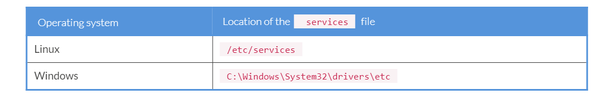

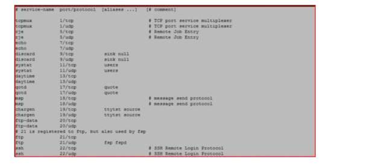

The network administrator is responsible for allocating new ports and
updating assigned ports in the previous code, which will be in effect
after the recycle.


#### Slimming of Tomcat application


Tomcat 8 comes with many applications and examples built-in with the
packages. It is always recommended to remove the application packages
which are not used. Following are the advantages of removing a
package:

- Reduction in the JVM memory utilization
- Chances of any vulnerability will be less, as unwanted applications
    (libraries/JAR) are not available
- Easier maintenance of applications

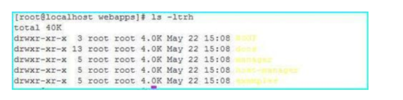


You can remove as many applications as you want to, the Tomcat Manager
can also be removed if it is not in use.


#### Disable hot deployment


Hot deployment or autodeployment is a process through which code will be
deployed to the application automatically, without recycling the
services. To disable the hot deployment, you have to
edit` server.xml` for the following parameter:


```
<Host name="localhost" appBase="webapps" unpackWARs="true" autoDeploy="true">
```


Change the` autoDeploy` to` false`.


```
<Host name="localhost" appBase="webapps" unpackWARs="true" autoDeploy="false">
```


After making the change, the application will get deployed to the web
server only after the recycle.


#### Password


We should not use any plain text password for the application or
configuration level and always use an encrypted password using MD5 or a
hashing algorithm. In order to enable the encryption password in Tomcat,
we have to follow a sequence of steps.

Let\'s discuss each step briefly and enforce the password encryption
policy for the Tomcat Manager.


1.  We have to define the password encryption algorithm in the Realm
    section of server.xml, as in the following line of code:

    ```
    <Realm className= "org.apache.catalina.realm.MemoryRealm"digest="MD5" />
    ```

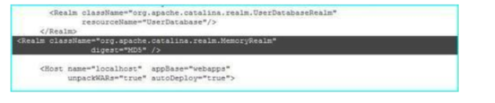
 
    
#### Note

    We can define the algorithm based on the OS requirement, such as
    SHA, RSA, MD5, and so on.


2.  Now go to tomcat\_home/bin and run the following command, it will
    generate the encrypted algorithm, as shown in the following
    screenshot:

    ```
    [root@localhost bin]# ./digest.sh -a MD5 secret
    ```

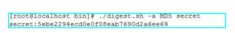
 
- The previous command can be described as `./digest.sh`
        = script, which generates the password for Tomcat
        `realm` and `-a` = algorithm used, currently
        we are using MD5 algorithm.


3.  Copy the MD5 string and replace the password text from
    tomcat\_user.xml with the following line of code:

    ```
    <user name="admin" password="5ebe2294ecd0e0f08eab7690d2a6ee69 " roles="manager-gui" />
    ```


4.  Reload the Tomcat services and log in to the Tomcat Manager using
    the password.

    
#### Note

    The password will not change here, we have only changed the method
    of storing passwords.
    


SSL configuration on Tomcat 8
-----------------------------------------------


**Secure Socket Layer** (**SSL**) is another way
of securing data communication. It is a cryptographic protocol, in which
data travels through a secure channel. The server sends a secure key to
the client browser, the client browser decrypts it and a handshake takes
place between the server and the client or we can say it\'s a two-way
handshake over the secure layer.

When is SSL required for Tomcat?

SSL will be more efficient if you are using Tomcat as a frontend server.
In case you are using Apache or IIS, then it\'s recommended to install
SSL on Apache or the IIS server.


### Types of SSL certificates


Before we go ahead and install SSL, let\'s discuss the two types of SSL
certificates, which are explained as follows:

- **Self-signed certificate:** This certificate is used for
    testing purposes by applications which are hosted in the internal
    environment, where no verification is required and in this only data
    travel will be secure.
- **Signed certificate:** This certificate is basically
    used in real-time external environments, where authentication is
    required and also data should travel over the secure channel. For
    this kind of certificate, we have various third parties who generate
    the signed certificate and send it to us.


### Process of installing SSL


The process of installing SSL varies for every server, but there are
certain parameters which are common to every server for generation of
the **Certificate Signing Request** (**CSR**). The
method of generating the CSR may vary, but information required for
generating the CSR remains the same. The following table provides the
CSR template:

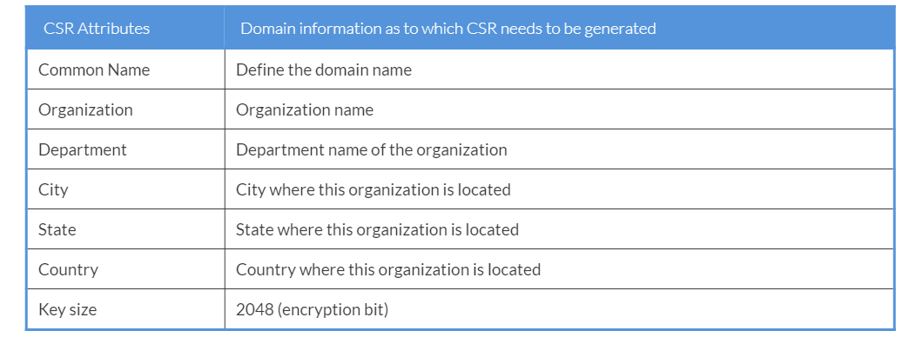

### Note


Common name: It is the hostname for which CSR needs to be generated.

Key size: It is the size of the encryption keys.


Let\'s do a real-time implementation for installation of the SSL
certificate on Tomcat 8. We will install SSL certificate for
host` tomcat8fenago.com` in Tomcat 8 by performing the
following steps:


1.  Create a CSR template for the tomcat8fenago.com.

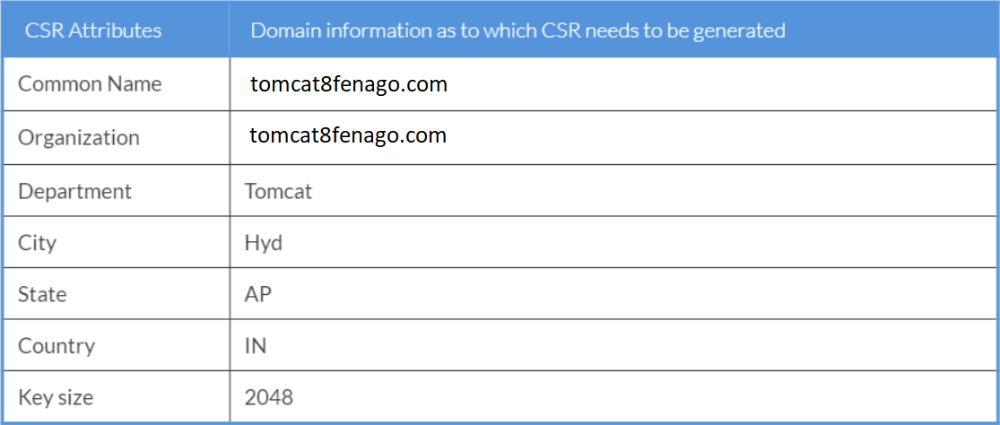

2.  We need to create the CSR for the host tomcat8fenago.com. For
    creating the CSR, we need to run the keytool present in
    JAVA\_HOME/bin. The following command will capture parameters for
    the CSR:


    ```
    [root@localhost conf] # cd /opt/apache-tomcat-8.5.61/conf
    [root@localhost conf] # keytool -genkey -alias tomcat8 -keyalg RSA -keysize 2048 -keystore tomcat8.jks
    ```

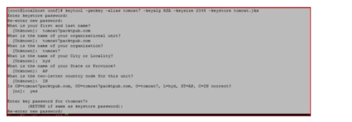


3.  Generate the certificate in CSR format using the following command.
    It will ask for the password and send it to the respective vendor
    for signed certificate creation.

    ```
    [root@localhost conf]# keytool -certreq -alias tomcat8 -file csr.txt -keystore tomcat.jks
    Enter keystore password:
    ```


4.  Import the certificate to the following Tomcat key store. Copy the
    tomcat8.jks in the TOMCAT\_HOME/conf.

    ```
    [root@localhost conf] # keytool -import -trustcacerts -alias tomcat8 -file tomcat8fenago.com.pb7 tomcat8.jks
    ```

Once you have signed the certificate created now, it\'s time to make
changes in the Tomcat configuration.


1.  Open server.xml and change the settings, as in the following code
    snippet:

    ```
    <Connector port="8443" protocol="HTTP/1.1"
    acceptCount="100" scheme="https" secure="true" SSLEnabled="true" 
    clientAuth="false" sslProtocol="TLS" keyAlias="tomcat8" keystoreFile="conf/tomcat8.jks" keystorePass="tomcat8" />
    ```


2.  Save the server.xml and restart the Tomcat services.

3.  Once the installation is done, the next step is to verify the SSL.
    You can access the application using the URL https://yoursitename or
    https://localhost:8443. Here, we have not created the signed
    certificate as it is a paid service, but we can use www.gmail.com as
    an example, which also uses SSL. Hit the URL, once the page is
    loaded, you will see the SSL icon. Click on it to view the
    certificate details, as shown in the following screenshot:


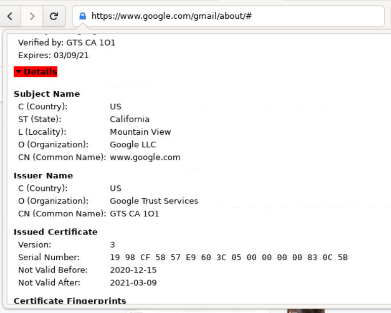


4.  If you click on Details, it shows that your certificate is
    successfully installed, as shown in the following screenshot:

    

Summary

-------------------------


In this lab, we have discussed the various policies of Tomcat 8 and
their functionalities, such as the Catalina policy and System level
policy. We have also discussed the different measures of enabling
security and their benefits, such as SSL, best practices used in
real-time industries to secure Tomcat 8 in the production environment by
changing the configuration, and SSL implementation.

In the next lab, we will discuss various real-time issues with
reference to Tomcat and their components and solutions.
